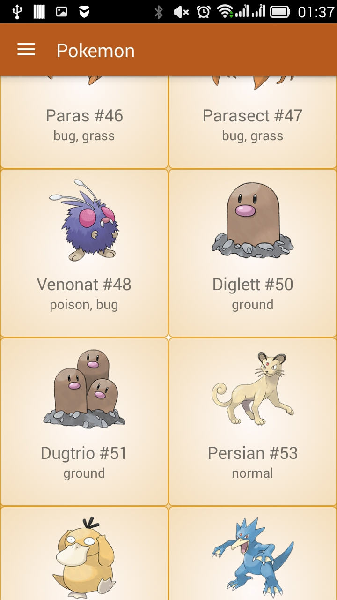
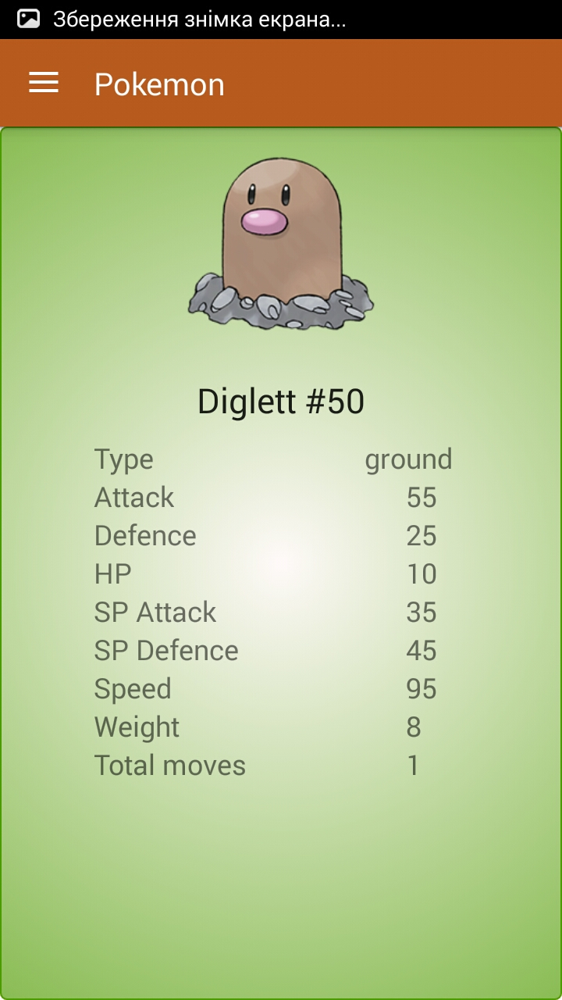
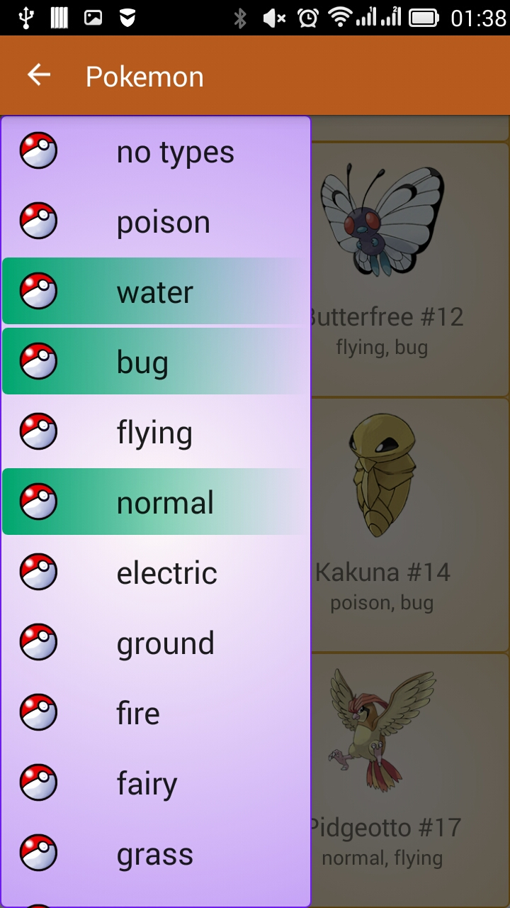
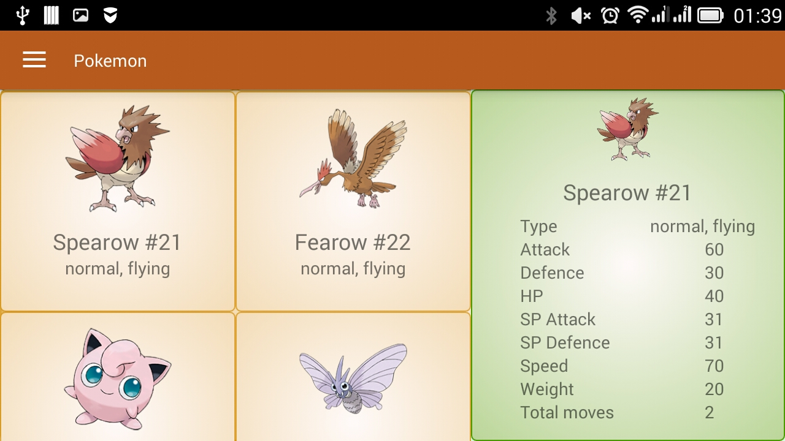

# Pokemon

## What is this application for?

This application downloads from the web and shows the user a list of Pokemon with detailed information about each.

## Key android mechanics:

+ Internet, 
+ JSON, 
+ GridView with custom adapters, 
+ simple Animation, 
+ AsyncTask,
+ Master detail flow,
+ Navigation drawer...

## Features:
The first list of Pokemon loaded after you click "load" button. The next will be loaded after you scroll table to the bottom. After each download list increased by 18 items.

You can view detailed information about each Pokemon clicking on it's cell in table.

Application allows you to filter the list of Pokemon by selected types.

In land-orientation of screen this app will look like this.

## [Download APK](bin/app-release.apk)
